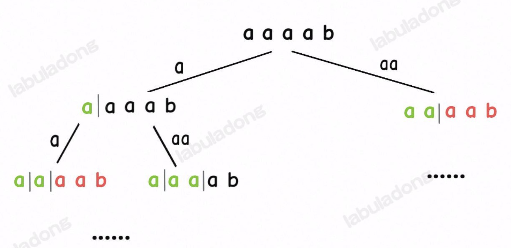

# 139. Word Break

[leetcode link](https://leetcode.com/problems/word-break/description/)      

**返回 input s 是否可以由 wordDit 组成，dictionary 里面的单词可以用多次。**

**Example 1:**   
Input: s = "leetcode", 
wordDict = ["leet","code"]               
Output: true        

**Example 2:**
Input: s = "applepenapple",     wordDict = ["apple","pen"]      
Output: true        

**Example 3:**
Input: s = "catsandog",         wordDict = ["cats","dog","sand","and","cat"]        
Output: false       

**本题最高效的解法 -> 🔴 「DP」 or「带备忘录的 DFS 算法」**

```java
Approach 1
            applepenapple
            /            \    x
        apple             pen           dfs 里循环 word dictionary 
        /    \                          去看是否有匹配的 substring
    apple x   pen
            /     \
        apple ✓    pen x  

Approach 2 

将 word dictionary 存到 set 里
循环 string s 如果遇到可以匹配word
进行下一层的 dfs

            applepenapple
            /   |    \     \
        a      ap     ..    apple        
                           /  |   \
                          p  pe    pen
```

如果 string s 特别长 但是 word dictionary 很少的话，遍历 word dictionary。      
但如果 word dictionary 很多 words 的话，可以 遍历 string s，从而 O(1) 查看是否有匹配的 word。


## Approach 1 -> Time Limit
```java
class Solution {
    boolean found = false;
    public boolean wordBreak(String s, List<String> wordDict) {
        /*
                applepenapple
                /            \    x
            apple             pen
            /    \
        apple x   pen
                /     \
            apple ✓    pen x  
        */
        dfs(s, wordDict, 0);
        return found;
    }

    private void dfs(String s, List<String> wordDict, int index) {
        if (found) {
            return;
        }
        if (index == s.length()) {
            found = true;
            return;
        }
        for (int i = 0; i < wordDict.size(); i++) {
            String cur = wordDict.get(i);
            int len = cur.length();
            if (index + len <= s.length() && 
                s.substring(index, len + index).equals(cur)) {
                dfs(s, wordDict, index + cur.length());
            }
            /* 
            boolean check = true;
            for (int j = 0; j < cur.length(); j++) {
                if (cur.charAt(j) != s.charAt(j + index)) {
                    check = false;
                    break;
                }
            }
            if (!check) continue;
            */
        }
    }
}
```

设 `wordDict` 的长度为 `M`，字符串 `s` 的长度为 `N`，那么这段代码的最坏时间复杂度是 `O(MN)`（for 循环 `O(M)`，Java 的 substring 方法 `O(N)`），所以总的时间复杂度是 `O(2^N * MN)`。     

优化：通过穷举 `s[i..]` 的前缀去判断 wordDict 中是否有对应的单词

## Approach 2 -> Time Limit
```java
class Solution {
    Set<String> dict = new HashSet<>();
    boolean found;
    public boolean wordBreak(String s, List<String> wordDict) {
        for (int i = 0; i < wordDict.size(); i++) {
            dict.add(wordDict.get(i));
        }
        dfs(s, 0);
        return found;
    }

    private void dfs(String s, int index) {
        if (index == s.length()) {
            found = true;
            return;
        }
        if (found) {
            return;
        }
        for (int i = index + 1; i <= s.length(); i++) {
            if (dict.contains(s.substring(index, i))) {
                dfs(s, i);
            }
        }
    }
}
```
优化后这段代码，总的时间复杂度依然是指数级的 `O(2^N * N^2)`，是无法通过所有测试用例的，那么问题出在哪里呢？

比如输入 wordDict = ["a", "aa"], s = "aaab"，算法无法找到一个可行的组合，所以一定会遍历整棵回溯树，但你注意这里面会存在重复的情况：


如果从后往前看 

## Approach3 -> DP + DFS 带备忘录的 DFS 算法

```java
// 定义：返回 s[i..] 是否能够被拼出
int dp(String s, int i);

// 计算整个 s 是否能被拼出，调用 dp(s, 0)
```
memo[len]
memo[i] = 1 -> 从 index i 到 tail 可以由字典构成        
memo[i] = -1 -> 从 index i 到 tail 不可以由字典构成     
memo[i] = 0 -> 从 index i 到 tail 还没有被看过

```java
class Solution {
    // 用哈希集合方便快速判断是否存在
    HashSet<String> wordDict;
    // 备忘录，-1 代表未计算，0 代表无法凑出，1 代表可以凑出
    int[] memo;

    // 主函数
    public boolean wordBreak(String s, List<String> wordDict) {
        // 转化为哈希集合，快速判断元素是否存在
        this.wordDict = new HashSet<>(wordDict);
        // 备忘录初始化为 -1
        this.memo = new int[s.length()];
        Arrays.fill(memo, -1);
        return dp(s, 0);
    }

    // 定义：s[i..] 是否能够被拼出
    boolean dp(String s, int i) {
        // base case
        if (i == s.length()) {
            return true;
        }
        // 防止冗余计算
        if (memo[i] != -1) {
            return memo[i] == 0 ? false : true;
        }

        // 遍历 s[i..] 的所有前缀
        for (int len = 1; i + len <= s.length(); len++) {
            // 看看哪些前缀存在 wordDict 中
            String prefix = s.substring(i, i + len);
            if (wordDict.contains(prefix)) {
                // 找到一个单词匹配 s[i..i+len)
                // 只要 s[i+len..] 可以被拼出，s[i..] 就能被拼出
                boolean subProblem = dp(s, i + len);
                if (subProblem == true) {
                    memo[i] = 1;
                    return true;
                }
            }
        }
        // s[i..] 无法被拼出
        memo[i] = 0;
        return false;
    }
}
```

## Approach4 -> DP -> O(n^3)
```java
class Solution {
    public boolean wordBreak(String s, List<String> wordDict) {
        Set<String> set = new HashSet<>();
        for (String word : wordDict) {
            set.add(word);
        }
        boolean[] memo = new boolean[s.length() + 1];
        // memo[i] -> s.substring(0, i) 是否可以组成
        memo[0] = true;
        // 什么都没有的时候是 true
        for (int i = 1; i <= s.length(); i++) {
            for (int j = i - 1; j >= 0; j--) {
                if (memo[j] && set.contains(s.substring(j, i))) {
                    memo[i] = true;
                    break;
                }
            }
        }
        return memo[memo.length - 1]; 
    }
}
```