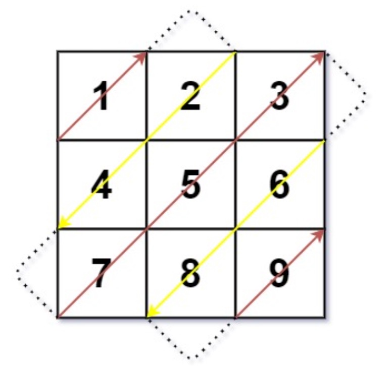

# 498. Diagonal Traverse
Given an `m x n` matrix `mat`, return an array of all the elements of the array in a diagonal order.        

**Example 1:**



根据 r 和 c 的 和 是否可以整除 2 来判断向上走还是向下走

```java
class Solution {
    public int[] findDiagonalOrder(int[][] mat) {
        if (mat == null || mat.length == 0) {
            return new int[0];
        }
        int rows = mat.length;
        int cols = mat[0].length;
        int[] result = new int[rows * cols];
        int r = 0;
        int c = 0;
        for (int i = 0; i < result.length; i++) {
            result[i] = mat[r][c];
            if ((r + c) % 2 == 0) { // Move up
                if (c == cols - 1) {
                    // 到达最后一列. 移动到同列的下一场行
                    // 需要先判断这个 去 check 右上角
                    r++;
                } else if (r == 0) {
                    // 到达第一行 去下一列
                    c++;
                } else {
                    // 中间
                    r--;
                    c++;
                }
            } else { // Move down
                if (r == rows - 1) {
                    // 最后一行，移动到本行的下一列
                    // 同样先 check 因为左下角
                    c++;
                } else if (c == 0) {
                    r++;
                } else {
                    r++;
                    c--;
                }
            }
        }
        return result;
    }
}
```